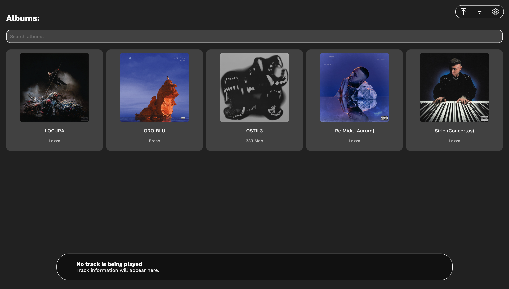
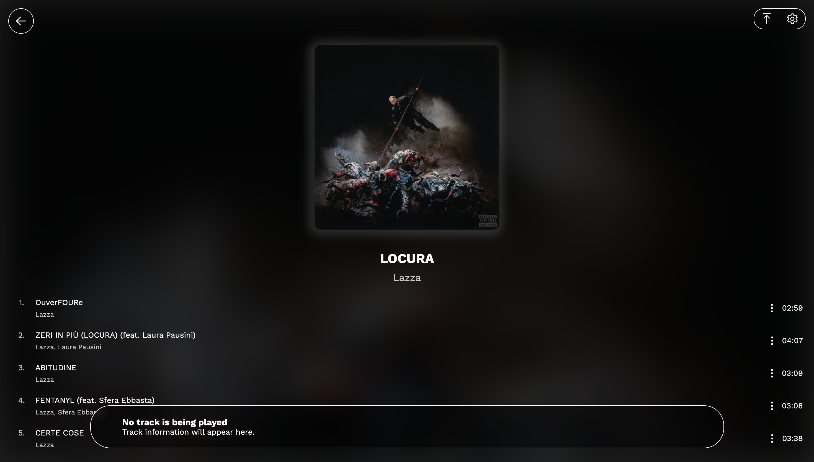
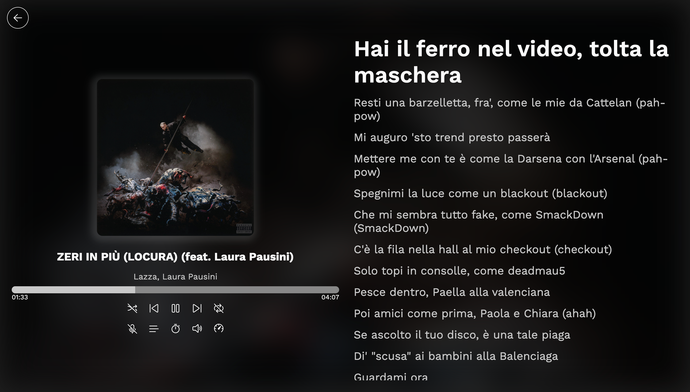
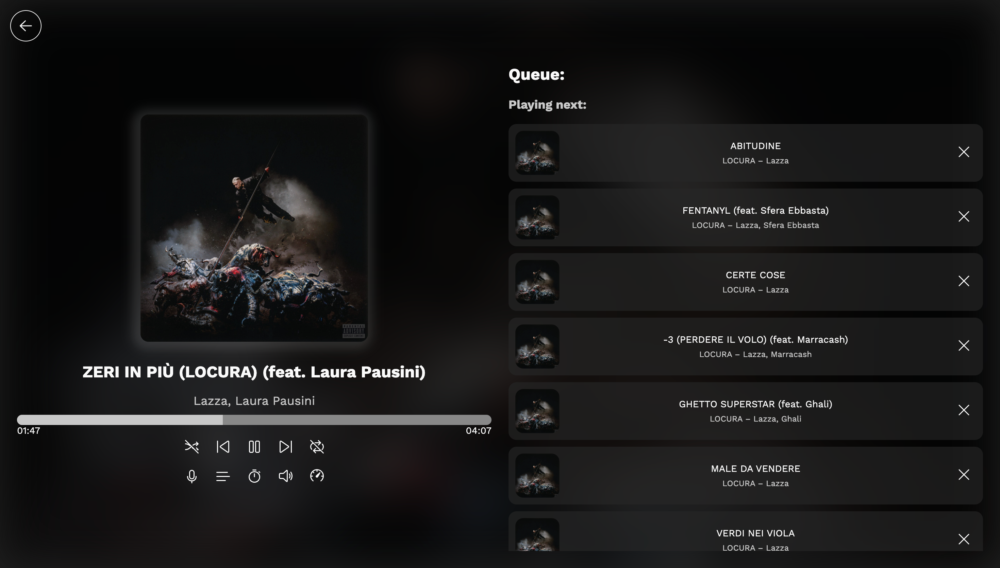

# MusicPlay

MusicPlay is a web player for local music. Listen to all the songs of your library from your browser, without uploading anything to an external server.

https://github.com/user-attachments/assets/7b23e4c3-b424-4bdd-b505-3af0088f5ee0

## Features: 

- Group your library by album, artists, album artists or tracks;
- Create multiple playlists;
- Adjust metadata of loaded songs;
- View the playback stats of your tracks;
- View the lyrics of your songs, or fetch them from the Web if they're not available;
- Set a sleep timer;
- And more.

## Usage

The user will be first prompted to upload some files, that will be saved **only locally** inside the browser's database. If a Chromium-based browser is used, the files will not be copied, saving lots of storage. 

### Library group

After some songs have been uploaded, the user will se the "Album" section, with all the albums tied to the uploaded songs. By clicking on the second of the three buttons on the top-right corner of the website, the user can change the criteria used to group the songs. From the same dropdown menu, the user can see all the playlist that have been created.

### Album list

To listen to a song, just click on the album/artist name, and a list with all the songs will appear. Click on the song track to start the playback. Some metadata will be shown in the bottom of the webpage. 

### Main player

Click on the album art visible on the pop-up player at the bottom of the page to open the main player. Here you'll see the album art, along with the music controls:

- The buttons to skip to the next/previous song;
- The button to play/pause the song;
- The button to enable or disable the shuffle;
- The button to toggle between the three loop options (loop disabled, loop around the queue, loop the currently-playing song);
- The button to show lyrics (if available);
- The button to see the queue;
- The button to start or stop a sleep timer;
- The button to regulate the volume of the track;
- The button to change the playback rate of the song.

### Lyrics

MusicPlay can display lyrics, both synced and unsynced. Lyrics can either be embedded in the file, imported from a LRC/TTML file, or fetched from LRCLib. In this last case, disabled by default, the application will share some metadata (but never the music file) with LRCLib. 

### Queue

From the queue, the user can change the order of the next tracks that will be played. The user can also add a song to the queue from the dropdown list that is displayed when the three dots at the left of the song duration are clicked. The user can, from this menu, also add the song to a playlist, delete it from the application, edit the metadata, download it or show the playback stats.

### Editing metadata

If the application hasn't correctly fetched some metadata, you can edit them in two ways:

- The first one is by clicking on the album art when an album group is being displayed. A dialog will be displayed where you can change the album art (or upload a custom one), along with other information such as the number of disks, the album artist and so on. 
   * Note: if you click on the album art while you're seeing the songs of an artist or an album artist, you'll be able to upload a custom icon for that artist;
   * Note: if you click on the album art while you're seeing a playlist, you'll be able to change the playlist name, or upload a custom playlist thumbnail.
- The second one is by using the "Edit metadata" button from the dropdown list that is displayed when the three dots at the right of the song name are clicked. In this case, you'll edit the metadata of that single song.

Note that the application won't apply the new metadata on the file if you download it from the "Save file" button.

### Playlists

As said before, you can create playlists and upload a custom thumbnail for them. You can also change the order the songs in a playlist are displayed: in fact, you can choose to sort all the elements according to their album, to their artist, to their album artist, to their title, or you can go back to the custom order.

If you've set the custom order, you can change it in two ways:

- The first one is by clicking on the three dots, and manually moving a song up or down;
- The second one is by dragging and dropping the song.

## Customization

From the "Settings" button, you can change the behavior of the application in many ways. You can, for example, decide to automatically fetch lyrics if they're missing, or you can change the color or the font used by the application.

## Privacy

This application can work completely offline. The application connects to external servers only to get the default font and to get lyrics if the user wants so.
